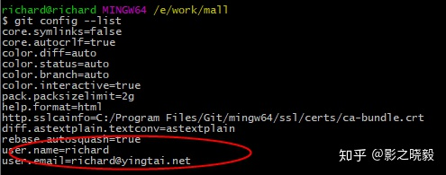
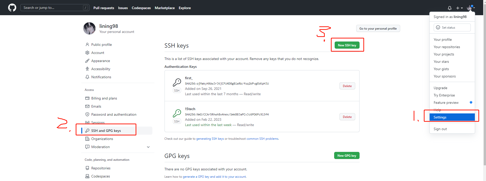
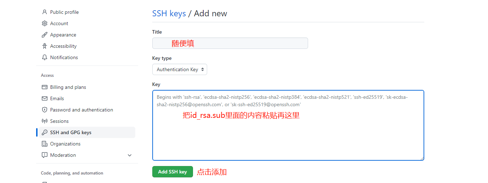

# git 安装

## **1.Git 官网下载安装 git 客户端：[https://git-scm.com/downloads/](https://git-scm.com/downloads/)**

## **2.安装完成后，在空白处点鼠标右键选择“Git Bush Here” ，打开 git bash 命令窗口**

## **3.配置用户名和邮箱**

git config —global user.name “xxx”

git config —global user.email “**[xxxx@xxx.com](mailto:richard@yingtai.net)**”

配置后结果：git config --list



## **4.执行命令生成 ssh pub_key**

```
ssh-keygen -t rsa -C "XXXX@XXX.com"
```

直接按三次回车，会生成 id_rsa.pub 文件，这个文件一般在 C 盘的.ssh 目录下。

## **5.打开生成后的 id_rsa.pub 文件，copy 内容到 git ssh 个人设置**





## **6.本地拉取代码**

就可以克隆 ssh 地址了

## TortoiseGit 安装

[TortoiseGit 安装和配置详细说明](https://blog.csdn.net/weixin_44299027/article/details/121178817)
